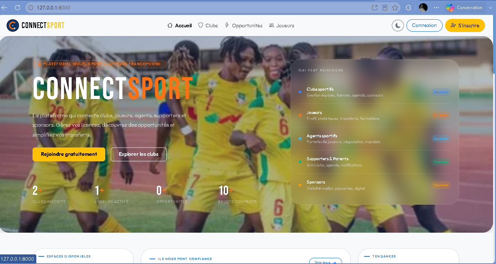
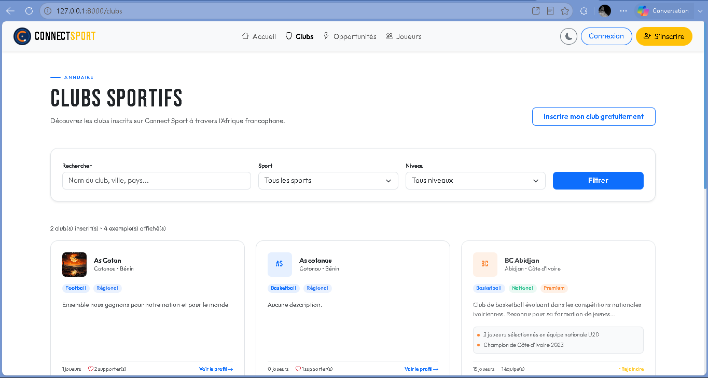
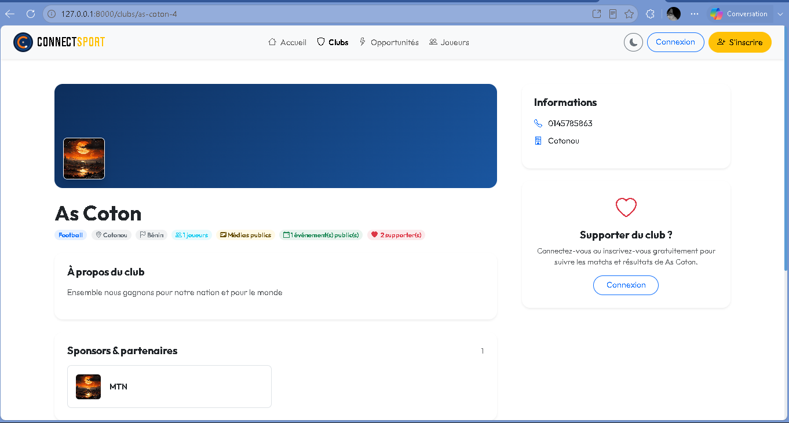
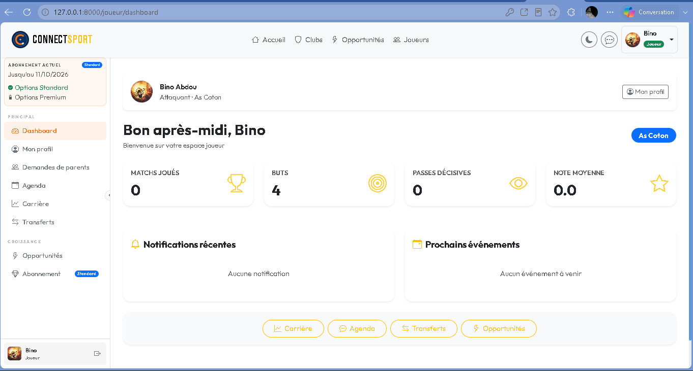
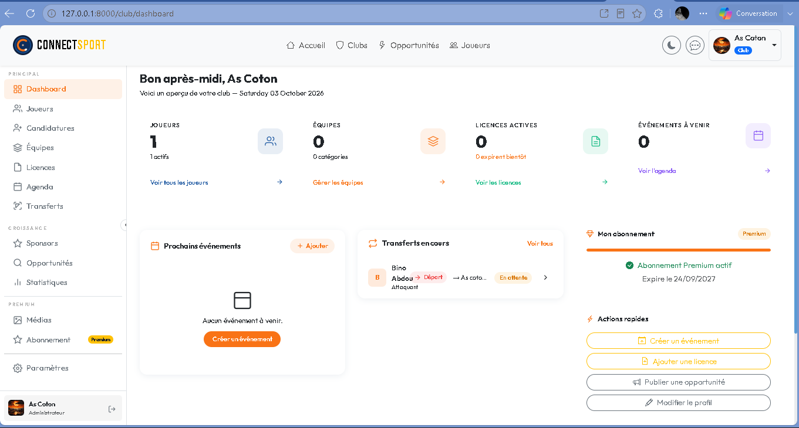
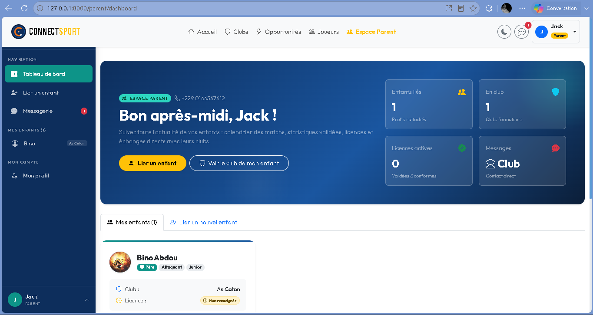
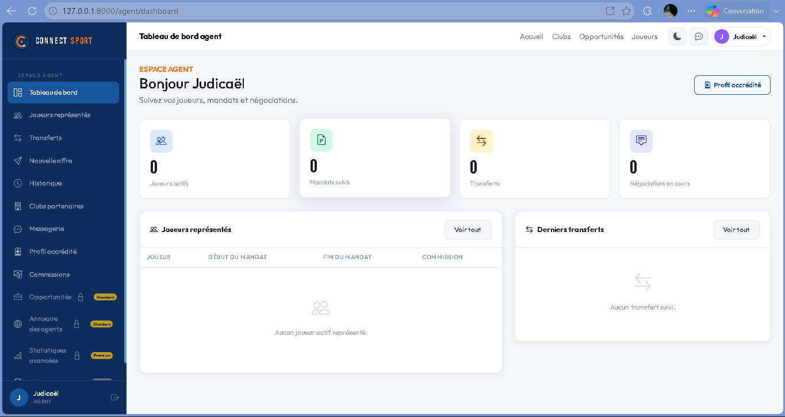
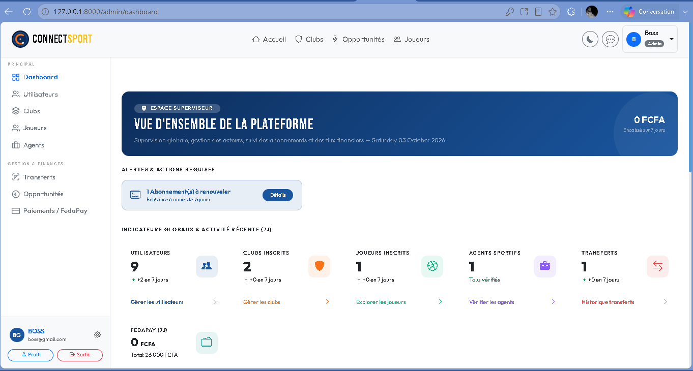

# Connect Sport

**Connect Sport** est une plateforme web multi-sports (football, basketball, handball, volleyball, etc.) qui digitalise la gestion des clubs et les met en relation avec les joueurs, les parents, les agents sportifs et les supporters. Chaque profil dispose de son propre espace, avec des droits adaptés à son rôle.

## Pourquoi ce projet ?

Dans beaucoup de clubs, les effectifs, les licences, les statistiques et les échanges sont gérés avec des outils dispersés (feuilles de calcul, messageries, papier). Connect Sport réunit tout dans une seule plateforme : un club organise ses équipes et ses joueurs, un joueur suit sa carrière, un parent suit son enfant, un agent accompagne les transferts et un supporter suit l'actualité de ses clubs.

## Profils et fonctionnalités

| Profil | Ce qu'il peut faire |
|---|---|
| **Club** | Gérer ses équipes et ses effectifs, ses licences et son agenda, publier des médias, traiter les candidatures des joueurs sans club, valider les transferts, saisir les statistiques de match, gérer ses sponsors et son abonnement |
| **Joueur** | Consulter son profil, sa carrière et ses statistiques (en lecture seule), demander un transfert, suivre l'agenda de son club, recevoir des notifications. Un joueur sans club peut candidater auprès des clubs |
| **Parent** | Lier son ou ses enfants, suivre leur club, leurs licences et leurs statistiques validées, échanger directement avec le club |
| **Agent sportif** | Suivre ses joueurs représentés, ses mandats, ses transferts et ses négociations, et envoyer des offres, avec un abonnement à paliers |
| **Supporter** | Créer gratuitement un compte pour suivre ses clubs, leur agenda, leurs matchs et résultats, et recevoir des notifications |
| **Administrateur** | Superviser la plateforme : utilisateurs, clubs, joueurs, agents, transferts, abonnements et paiements |

Les sponsors n'ont pas de compte : ce sont les clubs qui gèrent leurs partenariats, affichés sur leur fiche publique. Les pages publiques (accueil, annuaire des clubs, fiches clubs, agenda et médias publics) sont accessibles sans compte.

### Fonctionnalités transverses

- **Rôles et permissions** : chaque espace est protégé côté serveur par un middleware de rôles.
- **Carrière** : un joueur appartient à un club à la fois, avec un historique multi-clubs. Toute entrée devient officielle uniquement après validation du club.
- **Statistiques** : saisies uniquement par le staff du club, comme une feuille de match officielle, avec des données communes et des données propres à chaque sport.
- **Transferts** : initiés par le club ou par le joueur, avec suivi du statut (en attente, négociation, accepté, refusé, annulé).
- **Candidatures** : un joueur sans club postule, le club accepte ou refuse.
- **Abonnements à trois paliers** (Gratuit, Standard, Premium), avec rappel avant l'expiration.
- **Paiement en ligne** avec FedaPay (environnement sandbox).
- **Messagerie et notifications** en temps réel.
- **Médias** hébergés sur Cloudinary.
- **Interface** responsive, avec mode clair et sombre.

## Stack technique

| Couche | Technologies |
|---|---|
| Backend | Laravel, PHP |
| Frontend | Blade, Alpine.js, Bootstrap 5 |
| Base de données | MySQL |
| Paiement | FedaPay |
| Temps réel | Pusher |
| Médias | Cloudinary |

**Organisation du code** : les contrôleurs sont regroupés par profil (un dossier par acteur), les accès sont contrôlés par un middleware de rôles et des policies, et une tâche planifiée vérifie chaque jour les abonnements arrivant à expiration.

## Captures d'écran

### Pages publiques

*Page d'accueil : présentation de la plateforme et des profils qui peuvent la rejoindre.*

*Annuaire des clubs, avec recherche et filtres par sport et par niveau.*

*Fiche publique d'un club : informations, sponsors et partenaires, suivi par les supporters.*

### Espaces par profil

*Espace joueur : statistiques, notifications, prochains événements, carrière et transferts.*

*Espace club : effectifs, équipes, licences, agenda, transferts en cours et abonnement.*

*Espace parent : suivi de l'enfant, de son club et de ses licences, avec messagerie.*

*Espace agent : joueurs représentés, mandats, transferts et négociations.*

*Espace administrateur : vue d'ensemble de la plateforme, alertes d'abonnement et paiements FedaPay.*

## Auteur

**Judicaël Kodjori**, développeur web full-stack (Laravel), 

- GitHub : [@Judi-665](https://github.com/Judi-665)
- LinkedIn : [linkedin.com/in/judicaël-kodjori](https://linkedin.com/in/judicaël-kodjori)
